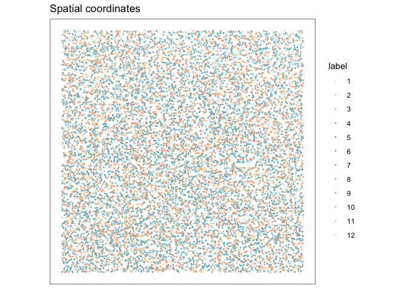
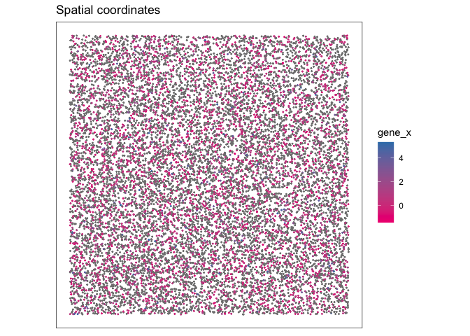

<!-- README.md is generated from README.Rmd. Please edit that file -->

# mousePreopticR

<!-- badges: start -->
<!-- badges: end -->

The goal of `mousePreopticR` is to enable more convenient
sharing/loading of bioinformatics gene expression datasets for analysis
in R, in particular mouse hypothalamic preoptic region cell data from
experiments by Moffit et al. The data can be found at
[GEO](https://www.ncbi.nlm.nih.gov/geo/query/acc.cgi?acc=GSE113576) and
[DRYAD](https://datadryad.org/stash/dataset/doi:10.5061/dryad.8t8s248).

## Installation

You can install the development version of `mousePreopticR` from
[GitHub](https://github.com/) with:

``` r
# install.packages("devtools")
devtools::install_github("wjonasreger/mousePreopticR")
```

Installing the package using `devtools::install_github` might have
issues due to memory size of package data or rate limits with GitHub.
Alternatively, you can download `mousePreopticR`
[here](https://github.com/wjonasreger/mousePreopticR/archive/refs/heads/master.zip).

You will need to unzip the package folder, remove *“-master”* from the
package folder name, and relocate it to your desired directory, then
install it with the following code using *your own path to the package*.

``` r
install.packages("/Users/wjonasreger/Documents/mousePreopticR", repos = NULL, type="source")
```

## Usage

This is a basic example which shows you how to setup the package
datasets for analysis:

***NOTE:** The package datasets are split components of sample datasets
due to GitHub size limits. So, the documented datasets (i.e.,
`mpr_barcodes`, `mpr_genes`, `mpr_matrix`, `mpr_merfish`) need to be
composed once after each install/update of the package. Then package
datasets can be loaded anytime after the initial composition step. You
may need to restart your R session after composition is completed.*

### Import packages

``` r
## import packages
library(mousePreopticR)
library(Seurat)
library(monocle3)
library(SpatialExperiment)
library(scran)
library(ggspavis)
library(nnSVG)
library(dplyr)
```

### Load Data

``` r
## compose datasets
#     - only need to run this once after installation. 
#     - may need to restart R session after composition.
composeData()


## load package datasets
#     - mpr_matrix, mpr_genes, mpr_barcodes
#     - mpr_merfish
loadData()


## load local data as expression matrix
#     - requires "matrix.mtx", "genes.tsv", and "barcodes.tsv" in data directory
# mpr_matrix = readMPR(data_dir = "mpr_experiment", cell_column = 1, gene_column = 1)


## viewing data
# to learn more about a dataset, use ?data_name (e.g., ?mpr_matrix)
?mpr_matrix
```

### Gene Expression Matrix Data Objects

``` r
## Seurat object with mpr_matrix (Seurat)
mpr_seurat = CreateSeuratObject(counts = mpr_matrix)
mpr_seurat
#> An object of class Seurat 
#> 7500 features across 7500 samples within 1 assay 
#> Active assay: RNA (7500 features, 0 variable features)


## CellDataSet object with mpr_matrix, mpr_barcodes, and mpr_genes (monocle3)
cds = new_cell_data_set(expression_data = mpr_matrix,
                        cell_metadata = mpr_barcodes,
                        gene_metadata = mpr_genes)
cds
#> class: cell_data_set 
#> dim: 7500 7500 
#> metadata(1): cds_version
#> assays(1): counts
#> rownames(7500): ENSMUSG00000051951 ENSMUSG00000089699 ...
#>   ENSMUSG00000028541 ENSMUSG00000085278
#> rowData names(2): ensembl_id gene_short_name
#> colnames(7500): AAACCTGAGATGTGGC-1 AAACCTGCACACAGAG-1 ...
#>   CAGCTAACACCATGTA-2 CAGCTAACACGGCGTT-2
#> colData names(2): barcode Size_Factor
#> reducedDimNames(0):
#> mainExpName: NULL
#> altExpNames(0):
```

``` r
## SpatialExperiment object with mpr_merfish (SpatialExperiment)
# view documentation of mpr_merfish data with spatial features
?mpr_merfish

# preprocess data
# define names for columns, rows, and meta data for intended matrix
names = list(
  col = colnames(mpr_merfish),
  row = mpr_merfish$Cell_ID,
  meta = c("Cell_ID", "Centroid_X", "Centroid_Y")
)

# define subset conditions
subs = list(
  col = setdiff(names[["col"]][10:170], "Fos"), # ignore Fos column due to NAs
  row = names[["row"]]
)

# convert merfish tabular data to matrix object with associated metadata
mpr_mf_mat = matrixify(data = mpr_merfish, names, subs, transpose = TRUE)

# define features for SpatialExperiment object
# expression matrix
counts = mpr_mf_mat[["matrix"]]
# row data
row_data = data.frame(gene_short_name = counts@Dimnames[[1]])
rownames(row_data) = row_data$gene_short_name
# column data
col_data = data.frame(barcode = counts@Dimnames[[2]])
rownames(col_data) = col_data$barcode
# spatial coordinates
spatial_coords = as.matrix(apply(as.data.frame(mpr_mf_mat[["metadata"]][3:4]), 2, as.numeric))

# create SpatialExperiment
mpr_spe = SpatialExperiment(
  assays = list(counts = counts),
  rowData = row_data,
  colData = col_data,
  spatialCoords = spatial_coords
)
mpr_spe
#> class: SpatialExperiment 
#> dim: 160 13444 
#> metadata(0):
#> assays(1): counts
#> rownames(160): Ace2 Adora2a ... Ucn3 Vgf
#> rowData names(1): gene_short_name
#> colnames(13444): 4999c996-c108-4645-818f-1cc646505e26
#>   39dde9b2-a9df-4aa8-b57d-7bbbc851f3b5 ...
#>   ff5ac2dd-4687-4243-b172-9d7fe670daa3
#>   7d2862f4-2030-499e-9c1b-0266c556af26
#> colData names(2): barcode sample_id
#> reducedDimNames(0):
#> mainExpName: NULL
#> altExpNames(0):
#> spatialCoords names(2) : Centroid_X Centroid_Y
#> imgData names(0):
```

## Example Analysis of Spatial Experiment Data

``` r
# preprocessing
col_sums = colSums(counts(mpr_spe))
mpr_spe = mpr_spe[, col_sums > 0]
mpr_spe = logNormCounts(mpr_spe)
```

``` r
# graph-based clustering
set.seed(22)
k = 50
g = buildSNNGraph(mpr_spe, k = k, use.dimred = NULL)
g_walk = igraph::cluster_walktrap(g)
clus = g_walk$membership
table(clus)
#> clus
#>    1    2    3    4    5    6    7    8    9   10   11   12 
#>  360 1110 1068 1768 2832  448  177  269 1620 2632  298  862
```

``` r
# store cluster labels in column 'label' in colData
colLabels(mpr_spe) = factor(clus)

# salmon sushi color palette
paletteFn = colorRampPalette(c("#E7F2F8", "#74BDCB", "#FFA384", "#EFE7BC"))

# plot clusters in spatial x-y coordinates
plotSpots(mpr_spe, annotate = "label", in_tissue = NULL,
          palette = paletteFn(length(unique(clus))))
```



``` r
# convert from spe to so
colnames(mpr_spe) = 1:dim(mpr_spe)[2]
spe_seurat = CreateSeuratObject(counts = counts(mpr_spe))
#> Warning: Feature names cannot have underscores ('_'), replacing with dashes
#> ('-')
Idents(spe_seurat) = mpr_spe$label

# find all differentially expressed genes across clusters
spe_markers = FindAllMarkers(spe_seurat, verbose = FALSE)

# differentially expressed genes
diff_exp = spe_markers %>%
  group_by(cluster) %>%
  filter(avg_log2FC >= 1.5) %>%
  filter(p_val_adj <= 0.05) %>%
  arrange(desc(avg_log2FC))
diff_exp
#> # A tibble: 53 × 7
#> # Groups:   cluster [11]
#>        p_val avg_log2FC pct.1 pct.2 p_val_adj cluster gene   
#>        <dbl>      <dbl> <dbl> <dbl>     <dbl> <fct>   <chr>  
#>  1 1.94e-153       5.24 0.994 0.347 3.11e-151 7       Selplg 
#>  2 1.86e-136       4.96 0.594 0.171 2.98e-134 1       Myh11  
#>  3 2.39e-279       4.70 0.985 0.237 3.83e-277 8       Pdgfra 
#>  4 0               4.30 0.923 0.337 0         3       Slco1a4
#>  5 0               3.87 0.979 0.509 0         12      Sgk1   
#>  6 0               3.82 0.924 0.203 0         3       Fn1    
#>  7 0               3.81 0.968 0.301 0         12      Ermn   
#>  8 0               3.79 0.906 0.289 0         3       Rgs5   
#>  9 4.10e-215       3.67 0.99  0.437 6.56e-213 11      Cd24a  
#> 10 0               2.97 0.957 0.442 0         12      Ttyh2  
#> # ℹ 43 more rows
```

``` r
# plot top gene
mpr_spe[["gene_x"]] = log(counts(mpr_spe)["Selplg",])
plotSpots(mpr_spe, annotate = "gene_x", in_tissue = NULL,
          palette = "libd_layer_colors")
```



Ok, that’s all! You can now play
*[scientist](https://youtu.be/RB-RcX5DS5A)* and do fancy bioinformatics
analysis with the `mousePreopticR` datasets, or even use it’s
convenience functions to manage other datasets as you wish… but that’s
probably *a lot* of work. There are more exquisite ways to spend your
time such as getting coffee with your friend 😄☕ ☕😄

…You’re still here? Ok [watch this](https://youtu.be/xvFZjo5PgG0) for a
cackle ;)
